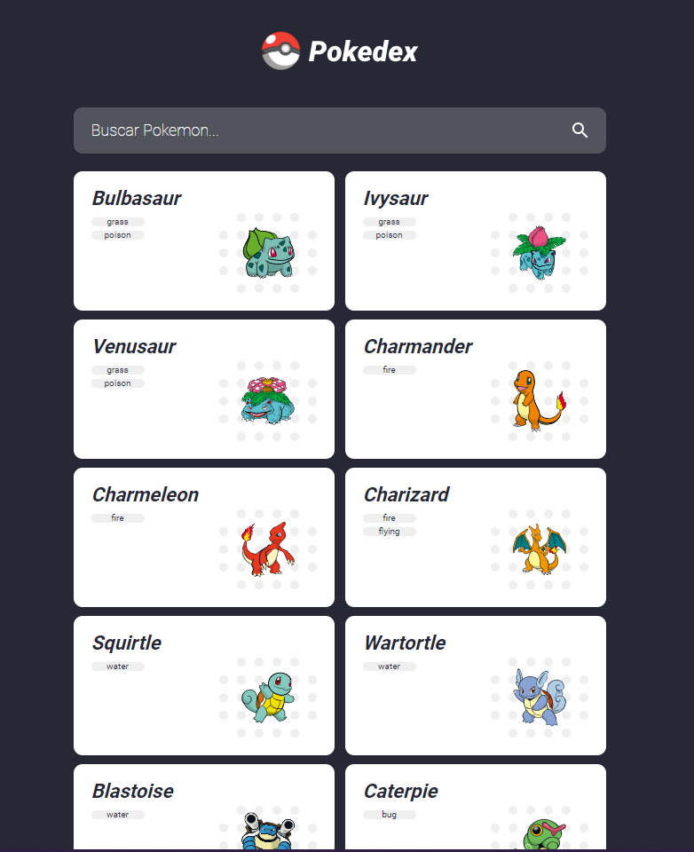

# Projeto Pokedex Angular 🚀

## Descrição 📋

Este é um projeto Pokedex desenvolvido com Angular CLI version 16.1.5. A Pokedex é uma aplicação web que permite aos usuários explorar uma lista de Pokemons, filtrá-los e visualizar os detalhes de cada Pokemon selecionado. 🐾🔍

Este projeto foi desenvolvido como parte do curso [Curso de Angular 2 (v15+) Typescript do Básico ao Avançado](https://www.udemy.com/course/curso-de-angular/) na Udemy.

## Funcionalidades 🚀

- Visualizar uma lista de Pokemons.
- Filtrar a lista de Pokemons.
- Visualizar os detalhes completos de um Pokemon específico.
- Navegação entre a lista de Pokemons e a página de detalhes. 

## Pré-requisitos ⚙️

Antes de prosseguir, verifique se você possui as seguintes ferramentas instaladas em seu sistema:

- Node.js 
- npm 

## Instalação 🛠️

Siga as etapas abaixo para executar o projeto localmente:

1. Certifique-se de que você tenha o Angular CLI versão 16.1.5 instalado globalmente. Caso contrário, você pode instalá-lo com o seguinte comando:
_npm install -g @angular/cli@16.1.5_

2. Clone o repositório do projeto.
   
3. Na raiz do projeto, execute o comando _npm install_ para instalar as dependências do projeto.

## Como Usar 🎮

Para iniciar o servidor de desenvolvimento, execute o seguinte comando:
_ng serve_

Abra o navegador e acesse a seguinte URL: _http://localhost:4200/_

## Build 🏗️

Para criar uma versão de produção da aplicação, execute o seguinte comando: _ng build --prod_

## Contato 📞
- LinkedIn - [@karolinequetz](https://www.linkedin.com/in/karolinequetz)

